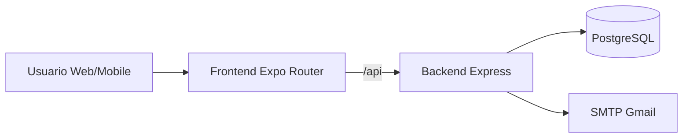

# SecPass


Aplicacao de gerenciamento de senhas com cliente Web/Mobile (Expo + React Native) e backend Node.js (Express) no mesmo dominio de producao.

## Escopo do Projeto

O projeto cobre 3 blocos principais:

1. Aplicacao cliente (Web + Mobile)
- Cadastro, login, cofre de senhas, busca, edicao, exclusao, copia e desbloqueio por biometria (nativo).
- Criptografia do cofre no cliente antes de salvar local/remoto (`encrypted_vault`).
- Fluxo de recuperacao de senha por token.

2. API backend
- Autenticacao: register, login, refresh, logout.
- Recuperacao: forgot-password e reset-password.
- Cofre remoto por usuario com isolamento de dados.
- Auditoria basica de eventos de seguranca.

3. Operacao e publicacao
- Deploy continuo no Vercel (frontend + API em `/api`).
- Workflows de CI, deploy app (EAS), deploy backend (Cloud Run) e release coordenada.

## Publicacoes Ativas

### Producao principal (ativa)

- URL unica do produto: https://password-manager-gules-one.vercel.app
- Frontend web: rota raiz (`/`)
- API backend: prefixo `/api`
  - Exemplo: `GET /api/health`

### Canais de publicacao suportados no repositorio

- Vercel (ativo): frontend + backend no mesmo dominio.
- EAS (ativo para build/distribuicao app): iOS/Android.
- Cloud Run (workflow existente): opcao de publicacao de backend em GCP.

## Matriz de Responsabilidade Operacional

| Dominio | Plataforma principal | Responsabilidade | Evidencia no repositorio |
| --- | --- | --- | --- |
| Frontend Web | Vercel | Build e entrega do app web (Expo Router export) | `vercel.json`, `src/app/*` |
| API Backend (producao atual) | Vercel Functions | Endpoints `/api/*`, auth, reset e cofre remoto | `api/index.js`, `backend/src/index.js` |
| App Mobile (distribuicao) | EAS | Build assinado e distribuicao iOS/Android | `.github/workflows/deploy-app-eas.yml`, `eas.json` |
| Banco de dados | Vercel Postgres | Persistencia de estado de auth/cofre/auditoria | Variaveis `DATABASE_URL`/`POSTGRES_URL` |
| E-mail transacional | Gmail SMTP | Envio de recuperacao de senha | Variaveis `SMTP_*`, `EMAIL_FROM` |
| Observabilidade basica | Backend | Health checks e auditoria de seguranca | `GET /api/health`, `GET /api/security/audit` |
| Canal alternativo de backend | Cloud Run (opcional) | Deploy dedicado do backend fora do Vercel | `.github/workflows/deploy-backend-cloudrun.yml` |

### Responsabilidade por rotina

| Rotina | Dono primario | Plataforma/ferramenta | Frequencia |
| --- | --- | --- | --- |
| Publicacao web/api | Engenharia | Vercel | Sob demanda (release/hotfix) |
| Publicacao mobile | Engenharia | EAS | Sob demanda (release mobile) |
| Rotacao de segredos | Engenharia/DevOps | Vercel + GitHub Secrets | Periodica ou incidente |
| Validacao de saude | Engenharia | `npm run smoke:prod` + `/api/health` | A cada deploy |
| Revisao de eventos de seguranca | Engenharia/SecOps | `/api/security/audit` | Semanal ou incidente |

## Banco de Dados

### Onde o banco foi criado/provisionado

- Banco em PostgreSQL provisionado no ambiente do projeto no Vercel (integracao de Postgres).
- A aplicacao backend usa variaveis `POSTGRES_URL` e/ou `DATABASE_URL`.

### Como o backend usa o banco

- Em producao, quando `DATABASE_URL` ou `POSTGRES_URL` existe, o backend opera com `storageBackend=postgres`.
- Tabela de estado: `AUTH_STORE_TABLE` (padrao: `auth_state`).
- Estado persistido: usuarios, refresh tokens, reset tokens, cofre por usuario e eventos de seguranca.

### Validacao de ambiente

- Endpoint: `GET /api/health`
- Esperado em producao: `ok=true`, `nodeEnv=production`, `storageBackend=postgres`

## Arquitetura Resumida



## Mapeamento de Funcionalidades

### Cliente (src)

- Autenticacao e sessao
  - Modos: `hybrid`, `remote`, `local` (`EXPO_PUBLIC_AUTH_MODE`)
  - Tela principal em `src/screens/HomeScreen.js`
- Cofre
  - Listagem, busca, criacao, edicao, exclusao, copia
  - Persistencia local segura + remoto quando habilitado
- Criptografia de cofre
  - `src/services/vaultCrypto.js`
  - Envelope criptografado enviado/recebido em `encrypted_vault`
- Recuperacao de senha
  - Leitura de token por URL/deep link
  - Rota web dedicada: `/reset-password`

### Backend (backend/src/index.js)

- Health
  - `GET /health`
  - `GET /health/ready`
- Auth
  - `POST /auth/register`
  - `POST /auth/login`
  - `POST /auth/refresh`
  - `POST /auth/logout`
- Password reset
  - `POST /auth/forgot-password`
  - `POST /auth/reset-password`
- Vault
  - `GET /vault/items`
  - `PUT /vault/items`
- Auditoria
  - `GET /security/audit`

## Mapeamento de Seguranca

- Senha de usuario no backend com hash (`bcrypt`).
- Access/refresh token com JWT e rotacao de refresh.
- Rate limit em endpoints de auth.
- Headers de seguranca (`helmet`) e CORS configuravel.
- Cofre cifrado no cliente (AES-CBC + HMAC) antes de persistir.
- Em producao, `EXPOSE_RESET_TOKEN=false`.

## Variaveis de Ambiente (Producao)

### Backend (essenciais)

- `NODE_ENV=production`
- `CORS_ORIGIN`
- `ACCESS_TOKEN_SECRET`
- `REFRESH_TOKEN_SECRET`
- `DATABASE_URL` ou `POSTGRES_URL`
- `AUTH_STORE_TABLE` (opcional, padrao `auth_state`)

### SMTP Gmail (producao atual)

- `SMTP_HOST=smtp.gmail.com`
- `SMTP_PORT=465`
- `SMTP_SECURE=true`
- `SMTP_USER=<gmail>`
- `SMTP_PASS=<senha_de_app_google>`
- `EMAIL_FROM="SecPass <seu_email@gmail.com>"`
- `PASSWORD_RESET_URL_BASE=https://password-manager-gules-one.vercel.app/reset-password`
- `EXPOSE_RESET_TOKEN=false`

## CI/CD e Workflows

Arquivos em `.github/workflows`:

1. `ci.yml`
- Lint e testes automatizados.

2. `deploy-app-eas.yml`
- Build e publicacao de app via EAS.

3. `deploy-backend-cloudrun.yml`
- Build Docker e deploy backend em Cloud Run (quando usado).

4. `release-coordenada.yml`
- Pipeline para coordenar release de app e backend.

## Estrutura do Projeto

```text
.
|- api/
|- backend/
|  |- src/index.js
|- src/
|  |- app/
|  |  |- _layout.tsx
|  |  |- index.tsx
|  |  |- reset-password.tsx
|  |- screens/HomeScreen.js
|  |- services/
|  |- utils/
|- scripts/smoke-prod.mjs
|- vercel.json
|- package.json
```

## Operacao em Producao

### Checks rapidos

1. Health
```bash
curl -s https://password-manager-gules-one.vercel.app/api/health
```

2. Smoke test de producao
```bash
npm run smoke:prod
```

3. Variaveis de producao no Vercel
```bash
npx vercel env ls production --project password-manager --scope paginaum
```

### Comportamento esperado do smoke

- `health.ok=true`
- `loginA.ok=true` e `loginB.ok=true`
- `saveA.ok=true` e `saveB.ok=true`
- `isolated=true`

## Execucao Local

Instalacao:

```bash
npm install
npm --prefix backend install
```

Rodar frontend + backend:

```bash
npm run dev
```

Rodar apenas web:

```bash
npm run dev:web
```

Rodar apenas backend:

```bash
npm run dev:backend
```

## Scripts

- `npm run dev`
- `npm run dev:web`
- `npm run dev:backend`
- `npm run lint`
- `npm run test`
- `npm run smoke:prod`
- `npm run build:web`

## Estado Atual (2026-07-17)

- Producao publicada e saudavel no Vercel.
- Backend em PostgreSQL com isolamento multiusuario validado.
- Recuperacao de senha por e-mail ativa (SMTP Gmail).
- Rota web de reset publicada (`/reset-password`) e funcional.
- Workflow de deploy backend Cloud Run com YAML valido.

## Licenca

Consulte `LICENSE`.
